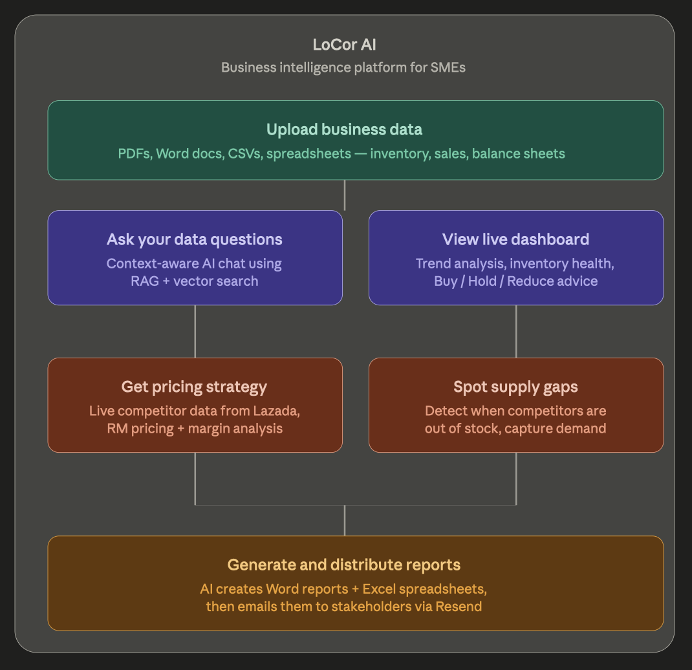

# LoCor AI 🚀

**LoCor AI** is an AI-powered business intelligence platform built for SMEs. Upload your sales sheets, inventory logs, and company description — and get actionable insights, competitive pricing strategies, automated Word/Excel reports, and a live AI consultant, all in one place.

---

## 🌟 Key Features



### 1. Unified Data Ingestion
- **Multi-Format Support**: Upload PDF, DOCX, or TXT company descriptions alongside CSV/XLSX spreadsheets for Inventory, Sales, and Balance Sheets.
- **Automated Parsing**: Uses `pandas` for tabular data and `PyMuPDF` / `python-docx` for document text extraction. All parsed data is vectorised and stored in ChromaDB on upload.

### 2. RAG-Powered Business Intelligence
- **Semantic Search**: Every question asked — in chat or when generating insights — is answered using Retrieval-Augmented Generation (RAG) over your own business data via ChromaDB.
- **Persistent Chat History**: Conversations are stored in SQLite and included in every AI request for coherent, multi-turn dialogue.
- **Streaming Responses**: Both the chat assistant and pricing strategy endpoints stream responses token-by-token for a responsive experience.

### 3. Automated Dashboard & Insights
- **Dashboard**: Generates a live KPI summary — Monthly Revenue, Total Sales, Top Category Revenue, and Items Needing Reorder — with category breakdowns and top 5 products.
- **Market Insights**: Identifies trending, stable, or slowing product categories. Returns structured buy/hold/reduce/watch recommendations written in plain language.
- **Inventory Health**: Flags stock as `critical` (below 20% capacity), `excess` (above 90%), or `ok`.

### 4. Competitive Pricing Strategy
- **Live Competitor Data**: Fetches real-time product listings from Lazada via API integration.
- **Redis Caching**: Competitor data is cached per product to avoid redundant API calls and speed up repeat lookups.
- **AI Pricing Analyst**: Analyzes your product's position (budget / mid-tier / premium), identifies supply gaps, and returns an exact RM price recommendation with margin impact and break-even analysis.
- **Token-Efficient Context**: Competitor data is encoded using TOON (instead of JSON) before being sent to the model, reducing token usage by ~25–30%.

### 5. Automated Report Generation & Email Delivery
- **Word Report**: Generates a structured weekly business proposal in Markdown, converted to `.docx` — covering Executive Summary, Key Insights, Recommendations, Inventory Changes, and Risks.
- **Excel Spreadsheet**: Produces a full updated inventory as a `.xlsx` file, with row-level change tracking (`added`, `removed`, `modified`, `unchanged`) and cell-level highlighting.
- **Email Distribution**: Reports are automatically emailed to stakeholders as attachments via the Resend API.

---

## System Architecture


---

## 🛠️ Tech Stack

### Frontend
| Layer | Technology |
|---|---|
| Framework | React 19 (Vite) |
| Routing | React Router 7 |
| Styling | TailwindCSS 4 |

### Backend
| Layer | Technology |
|---|---|
| API Framework | FastAPI (Python 3.10+) |
| AI Model | Z.ai — GLM-4.5-Flash |
| Vector DB | ChromaDB (RAG store) |
| SQL DB | SQLite (chat history) |
| Cache | Redis (competitor data) |
| Email | Resend API |

### Processing & Tools
| Tool | Purpose |
|---|---|
| Pandas / NumPy | Dataframe parsing and manipulation |
| PyMuPDF (`fitz`) | PDF text extraction |
| `python-docx` | DOCX parsing and Word doc generation |
| `openpyxl` | Excel generation with conditional formatting |
| `json-toon` | Token-efficient data encoding (~25–30% reduction) |
| ChromaDB | Persistent vector store with distance-threshold filtering |

---

## 🚀 Getting Started

### Prerequisites
- Python 3.10+
- Node.js & npm
- Redis running on `localhost:6379`
- [Z.ai API Key](https://docs.z.ai/)
- [Resend API Key](https://resend.com/)

### Backend Setup

1. Navigate to the `Backend` directory.
2. Create a `.env` file from `.env.example`:
   ```env
   Z_AI_API_KEY=your_zai_key
   RESEND_API_KEY=your_resend_key
   EMAIL=your_recipient_email
   ```
3. Install dependencies:
   ```bash
   pip install -r ../requirements.txt
   ```
4. Start the server:
   ```bash
   fastapi dev server.py
   ```

### Frontend Setup

1. Navigate to the `front_end` directory.
2. Install dependencies:
   ```bash
   npm install
   ```
3. Start the development server:
   ```bash
   npm run dev
   ```

---

## API Endpoints

| Method | Endpoint | Description |
|---|---|---|
| `POST` | `/initialise_data` | Upload and vectorise company description + spreadsheets |
| `GET` | `/chat_history` | Retrieve full chat history from SQLite |
| `POST` | `/chat_response/stream` | Stream a RAG-augmented AI chat response |
| `GET` | `/chat_response/clear` | Clear chat history and reinitialise DB |
| `POST` | `/clear_chat` | Alias for clearing chat history |
| `GET` | `/generate_insights` | Generate JSON market insights from business data |
| `GET` | `/generate_dashboard` | Generate JSON dashboard KPIs and trends |
| `GET` | `/generate_reports` | Generate and email Word + Excel reports |
| `POST` | `/pricing-strategy/stream` | Stream a competitor pricing analysis for a product |
| `GET` | `/products` | List all products with margin and stock status |

---

## Redis Setup Guide

### macOS

```bash
brew install redis
brew services start redis
redis-cli ping  # Expected: PONG

brew services stop redis   # Stop
brew services restart redis   # Restart
```

### Windows (via WSL2)

```powershell
# In PowerShell (Admin)
wsl --install
```

```bash
# In Ubuntu terminal
sudo apt update && sudo apt install redis-server -y
sudo service redis-server start
redis-cli ping  # Expected: PONG

sudo service redis-server stop   # Stop
sudo service redis-server restart   # Restart
```

### Linux (Ubuntu/Debian)

```bash
sudo apt update && sudo apt install redis-server -y
sudo systemctl start redis
sudo systemctl enable redis   # Auto-start on reboot
redis-cli ping  # Expected: PONG

sudo systemctl stop redis  # Stop
sudo systemctl restart redis  # Restart
```

### Python Client

```bash
pip install redis
```

```python
import redis
redis_client = redis.Redis(host='localhost', port=6379, db=0)
```

---

## 📂 Project Structure

```
LoCor_AI/
├── README.md
├── requirements.txt
├── architecture.png
├── Backend/
│   ├── server.py               # FastAPI entry point — all routes defined here
│   ├── cache_manager.py        # Redis cache for competitor pricing data
│   ├── .env.example
│   ├── ai_generation/
│   │   ├── ai_chat.py          # Chat, insights, and dashboard generation
│   │   └── ai_report.py        # Word + Excel report generation
│   ├── apis/
│   │   ├── base.py             # Shared API utility functions
│   │   ├── fetch_all_apis.py   # Orchestrates all external API calls
│   │   ├── lazada_api.py       # Lazada competitor data fetching
│   │   └── API_NOTES.md
│   ├── chat_history/
│   │   ├── database.py         # SQLite connection and setup
│   │   └── sql.py              # CRUD queries for chat messages
│   ├── processing_generation/
│   │   ├── generate.py         # Converts AI output to .docx and .xlsx
│   │   └── newsletter.py       # Sends email reports via Resend
│   ├── processing_tools/
│   │   └── parser.py           # Parses PDF, DOCX, TXT, CSV, XLSX uploads
│   ├── prompts/
│   │   ├── ai_generation.py    # Prompts for insights, dashboard, reports, Excel
│   │   ├── ai_pricing_strategy.py  # Pricing analyst prompt + mock data
│   │   ├── chat_history.py     # System prompt for the chat assistant
│   │   └── newsletter.py       # Prompts for document and Excel generation
│   └── vector_db/
│       ├── retriever.py        # ChromaDB query with distance-threshold filtering
│       └── vector_store.py     # ChromaDB ingestion with batching
└── front_end/
    ├── vite.config.js
    ├── package.json
    ├── api/                    # Frontend API client modules
    │   ├── chat.js
    │   ├── dashboard.js
    │   ├── documents.js
    │   ├── init.js
    │   ├── insights.js
    │   └── pricing.js
    ├── sample/                 # Sample input files for testing
    │   ├── company_description.txt
    │   ├── inventory.csv
    │   ├── sales.csv
    │   └── balance.csv
    └── src/
        └── pages/
            ├── Upload.jsx          # File upload interface
            ├── Dashboard.jsx       # KPI overview
            ├── Insights.jsx        # Market analysis view
            ├── Chat.jsx            # AI business assistant
            ├── Pricing.jsx         # Pricing strategy interface
            └── PricingDetail.jsx   # Per-product pricing detail
```

---

## ⚙️ Configuration Notes

### Switching to Mock Competitor Data
In `server.py`, set `USE_MOCK_PRICING = True` to use the bundled mock Lazada dataset instead of hitting the live API. Useful for local development without API credentials.

### ChromaDB Distance Threshold
The retriever filters results with a cosine distance above `1.8` (configurable in `retriever.py`). Lower this value to require higher semantic similarity before including a document in context.

### TOON Encoding
LoCor AI uses `json-toon` to serialise structured data before sending it to the model. This format is more token-efficient than JSON and is applied to both user product data and competitor listings in the pricing strategy flow.