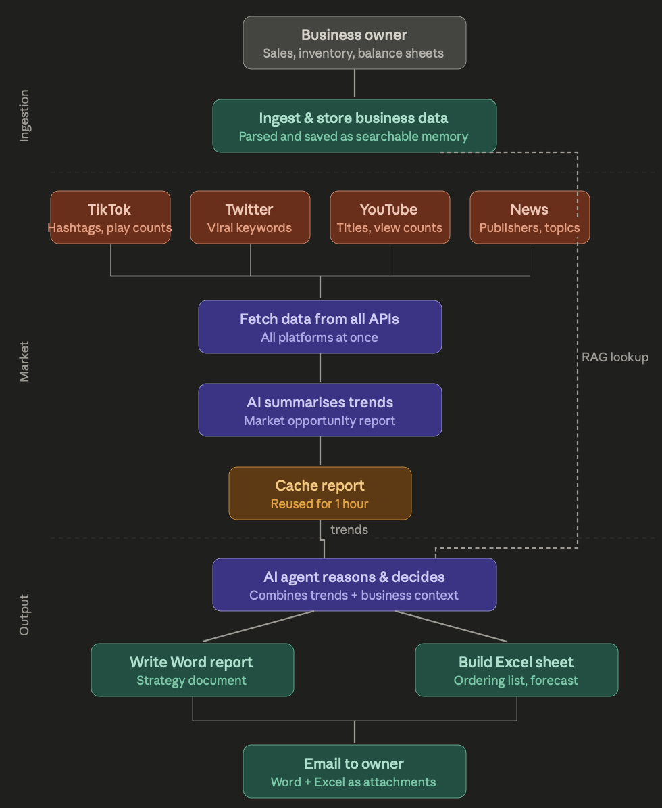

# LoCor AI 🚀

**LoCor AI** is an AI-powered business intelligence platform designed specifically for SMEs. It transforms raw business data—sales sheets, inventory logs, and company descriptions—into actionable insights, competitive pricing strategies, and automated reports.

---

## 🌟 Key Features

### 1. Unified Data Ingestion

- **Multi-Format Support**: Effortlessly upload and parse PDF/DOCX company descriptions and CSV/XLSX spreadsheets for Inventory, Sales, and Balance Sheets.
- **Automated Processing**: Uses `pandas` for dataframes and `PyMuPDF` / `python-docx` for document text extraction.

### 2. RAG-Powered Business Intelligence

- **Semantic Search**: Powered by **ChromaDB**, the system performs Retrieval-Augmented Generation (RAG) to provide context-aware answers based on _your_ specific business data.
- **Intelligent Chat**: An interactive assistant that understands your business context. Ask about stock levels, sales trends, or future procurement needs.

### 3. Automated Dashboard & Insights

- **Trend Analysis**: Real-time identification of trending, stable, or slowing product categories.
- **Actionable Advice**: Direct recommendations (Buy, Hold, Reduce, Watch) written like a professional consultant.
- **Inventory Health**: Visual tracking of stock status (Critical, Excess, OK) based on capacity and current levels.

### 4. Market & Competitive Intelligence

- **Real-time API Integration**: Fetches live competitor data from platforms like Lazada.
- **Pricing Strategist**: AI-driven analysis of the competitive landscape, providing exact RM pricing recommendations and profit margin analysis.
- **Supply Gap Identification**: Pinpoints when competitors are out of stock to help you capture "orphaned demand."

### 5. AI-Driven Automation

- **Report Generation**: Automatically generates professional Word reports and Excel spreadsheets via AI tool calls.
- **Seamless Distribution**: Integrated with **Resend** to email generated reports and spreadsheets directly to stakeholders.

---

## System Architecture



---

## 🛠️ Tech Stack

### Frontend

- **Framework**: React 19 (Vite)
- **Routing**: React Router 7
- **Styling**: TailwindCSS 4
- **State Management**: React Hooks & Context

### Backend

- **API Framework**: FastAPI (Python 3.10+)
- **Vector Database**: ChromaDB (for RAG)
- **SQL Database**: SQLite (for chat history)
- **Caching**: Redis (for API product data)
- **AI Models**: Z.ai (GLM-4.5-Flash)

### Processing & Tools

- **Data Science**: Pandas, NumPy
- **Document Parsing**: PyMuPDF (fitz), python-docx
- **Email Service**: Resend API
- **Token Optimization**: Toon-LLM (for efficient data encoding)

---

## 🚀 Getting Started

### Prerequisites

- Python 3.10+
- Node.js & npm
- Redis Server (running on localhost:6379)
- [Z.ai API Key](https://docs.z.ai/)
- [Resend API Key](https://resend.com/)

### Backend Setup

1. Navigate to the `Backend` directory.
2. Create a `.env` file based on `.env.example`:
   ```env
   Z_AI_API_KEY=your_zai_key
   RESEND_API_KEY=your_resend_key
   EMAIL=your_recipient_email
   ```
3. Install dependencies:
   ```bash
   pip install -r ../requirements.txt
   ```
4. Run the server:
   ```bash
   fastapi dev server.py
   ```

### Frontend Setup

1. Navigate to the `front_end` directory.
2. Install dependencies:
   ```bash
   npm install
   ```
3. Start the development server:
   ```bash
   npm run dev
   ```

---

# Redis Setup Guide

## Mac

### Install

```bash
# Install Homebrew if not already installed
/bin/bash -c "$(curl -fsSL https://raw.githubusercontent.com/Homebrew/install/HEAD/install.sh)"

# Install Redis
brew install redis
```

### Start

```bash
brew services start redis
```

### Verify

```bash
redis-cli ping
# Expected: PONG
```

### Stop

```bash
brew services stop redis
```

### Restart

```bash
brew services restart redis
```

---

## Windows

### Install

```powershell
# 1. Open PowerShell as Administrator and enable WSL2
wsl --install

# 2. Restart your PC, then open Ubuntu terminal and run:
sudo apt update
sudo apt install redis-server -y
```

### Start

```bash
sudo service redis-server start
```

### Verify

```bash
redis-cli ping
# Expected: PONG
```

### Stop

```bash
sudo service redis-server stop
```

### Restart

```bash
sudo service redis-server restart
```

> ⚠️ **Note:** WSL does not auto-start on reboot. You will need to run `sudo service redis-server start` every time you restart your PC.

---

## Linux (Ubuntu/Debian)

### Install

```bash
sudo apt update
sudo apt install redis-server -y
```

### Start

```bash
sudo systemctl start redis
```

### Enable auto-start on reboot

```bash
sudo systemctl enable redis
```

### Verify

```bash
redis-cli ping
# Expected: PONG
```

### Stop

```bash
sudo systemctl stop redis
```

### Restart

```bash
sudo systemctl restart redis
```

---

## Python Client (All Platforms)

```bash
pip install redis
```

```python
import redis
redis_client = redis.Redis(host='localhost', port=6379, db=0)
```

---

## 📂 Project Structure

```bash
LoCor_AI/
├── .gitignore
├── architecture.png
├── README.md
├── requirements.txt
├── Backend/
│   ├── .env.example    # Example environment config
│   ├── ai.py     # AI logic for chat and automated business insights using Z.ai
│   ├── main.py   # Test script for end-to-end AI automation loop
│   ├── server.py    # FastAPI backend server
│   ├── chat_history/
│   │   └── sql.py   # Storage for chat messages
│   ├── pricing_strategy/
│   │   ├── ai_summarise.py   # AI logic for summarizing APIs
│   │   ├── fetch_all_apis.py    # Orchestrate fetching of APIs
│   │   ├── main.py
│   │   ├── TEST_DATA.py   # Sample data to test AI summarization
│   │   └── apis/    # Individual API files
│   ├── db/
│   │   ├── data_feeder.py    # Store business data into ChromaDB
│   │   └── query.py    # Vector search queries for RAG
│   ├── processing_generation/
│   │   ├── generate.py    # Generate Word and Excel documents
│   │   ├── newsletter.py     # Sends email report to user
│   │   └── tools.py    # Define AI tool calls
│   └── processing_tools/
│       └── parser.py   # Extracts data from PDF, DOCS, CSV and XLSX files
└── front_end/
    ├── eslint.config.js
    ├── index.html
    ├── LICENSE
    ├── package.json
    ├── vite.config.js
    ├── api/
    │   ├── chat.js     # AI chat API
    │   ├── init.js     # System initialization and status
    │   └── insights.js    # Fetch business insights
    ├── public/
    ├── sample/   # Sample documents as input
    └── src/
        ├── App.css
        ├── App.jsx
        ├── index.css
        ├── main.jsx
        ├── shared.css
        ├── assets/
        │   ├── hero.png
        │   ├── react.svg
        │   └── vite.svg
        └── pages/
            ├── Chat.jsx      # Interactive AI business assistant interface
            ├── Dashboard.jsx    # Overview of business health and KPIs
            ├── Insights.css
            ├── Insights.jsx     # Detailed business strategy and market analysis view
            └── Upload.jsx    # File input interface
```

---

## Optimization

### Uses TOON Instead of JSON

Reduces token usage by ~25-30%, allowing for a faster model processing

### Redis Caching

Prevents duplicative API calls within a short timeframe. Enhances data retrieval speed

---
